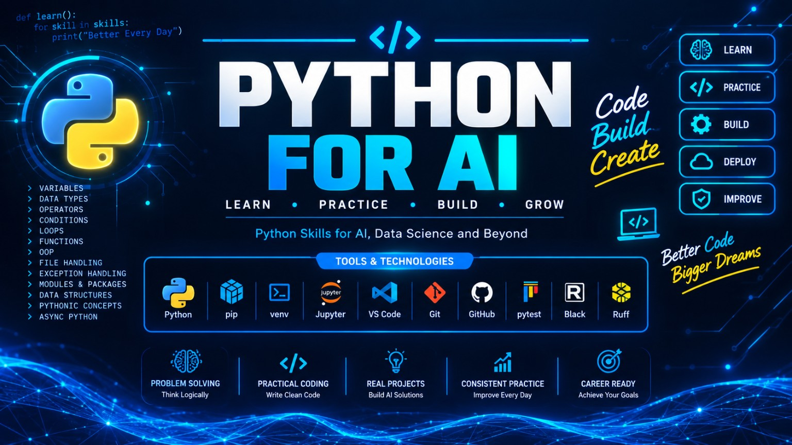

<p align="center">
  
</p>

# 🐍 Python for AI Engineering

A structured Python learning repository focused on building the programming foundation required for Artificial Intelligence and Machine Learning Engineering.

## 🎯 Goal

Build strong Python skills from fundamentals to advanced software engineering concepts and apply them to real AI/ML projects.

## 📚 Learning Path

### 01. Fundamentals
- Variables
- Data Types
- Operators
- Conditions
- Loops
- Functions
- Lists
- Tuples
- Sets
- Dictionaries
- Strings
- File Handling
- Exception Handling
- Modules
- Packages

### 02. Intermediate Python
- Comprehensions
- Iterators
- Generators
- Decorators
- Context Managers
- Regular Expressions
- Type Hints
- Dataclasses

### 03. Object-Oriented Programming
- Classes and Objects
- Constructors
- Encapsulation
- Inheritance
- Polymorphism
- Abstraction
- Composition
- SOLID principles

### 04. Advanced Python
- Memory Management
- Descriptors
- Metaclasses
- Advanced Functions
- Advanced Iteration
- Internals

### 05. Async Python
- Async/Await
- Coroutines
- Tasks
- Event Loops
- Async APIs
- Concurrent Programming

### 06. Testing
- unittest
- pytest
- Fixtures
- Mocking
- Test-Driven Development
- Code Coverage

### 07. Software Engineering
- Clean Code
- Design Patterns
- Logging
- Configuration
- Error Handling
- API Development
- Project Architecture

### 08. Packaging
- Virtual Environments
- pip
- pyproject.toml
- Package Development
- Dependency Management

### 09. Performance
- Profiling
- Time Complexity
- Memory Optimization
- Multiprocessing
- Multithreading
- Caching

### 10. Projects
Practical Python projects designed to strengthen AI engineering skills.

## 🛠️ Tools

- Python
- Jupyter Notebook
- Git & GitHub
- pytest
- Ruff
- mypy
- uv

## 🚀 AI Engineering Applications

Python skills developed here will be used throughout my AI Engineering journey:

```text
Python
   ↓
Data Engineering
   ↓
Machine Learning
   ↓
Deep Learning
   ↓
NLP & Transformers
   ↓
Generative AI & LLMs
   ↓
RAG & AI Agents
   ↓
MLOps / LLMOps
   ↓
Production AI Systems
